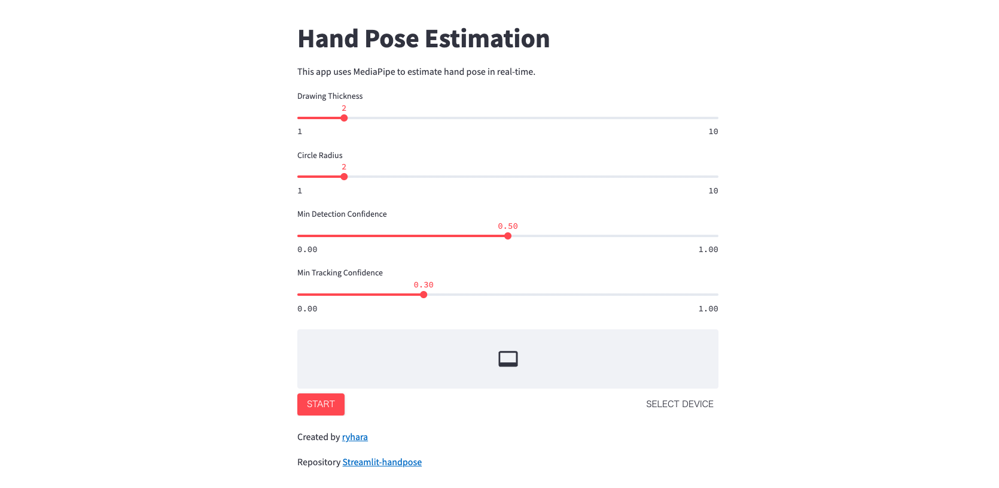
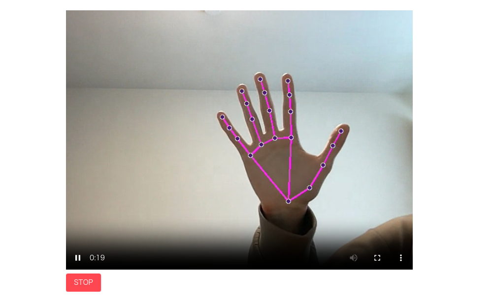

# Streamlit HandPoseEstimation App

streamlitとmediapipeを用いたHand Pose EstimationのWebアプリケーションです。





## Deploy
下記URLにてデプロイしています。無料枠のため

## Setup
ローカル環境で動かす場合以下のライブラリが入っていれば動くと思います。

- streamlit
- mediapipe=0.10.9
- opencv
- av

```
pip install -r requirements.txt
```

## Usage
```
streamlit run src/app.py
```

## reference
- [ブラウザで動くリアルタイム画像/音声処理アプリをStreamlitでサクッと作る](https://zenn.dev/whitphx/articles/streamlit-realtime-cv-app)
- [【Python】Streamlit Sharingで簡単・爆速でWebページをデプロイする！ #Python - Qiita](https://qiita.com/kagami_t/items/c54702e271d729948e24)